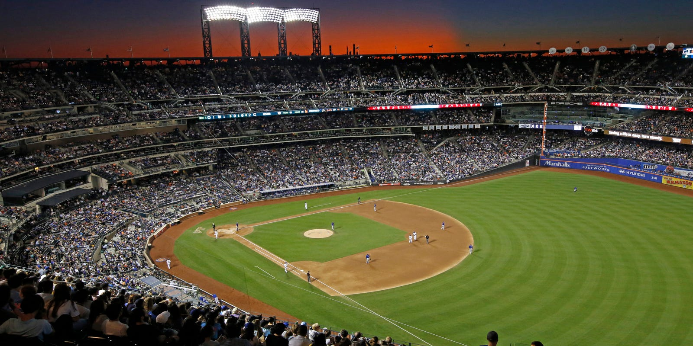

# Machine_Learning_MLB_Game_Predictions

## Key Findings

- Since we trained our data on the Astros, we only predicted Astros games during the playoffs. We were able to correctly predict 9 out of 14 games. One thing we did not take into account was an X factor for playoff games. Due to this X factor, we believe the games we predicted wrong, would've been right during the regular season. 

- With our models only trained on the Astros, we realized it did not place a high priority on the batting staticis for the Astros due to it being the same for each game. If we were to incorporate other teams into our training data, our models could prioritize different metrics and have a greater F-1 score.

- In the future, we plan on incorporating the score sets to accurately predict what the final score will be instead of purely the outcome. 

## Hypothesis 

Using metrics we've identified below, we wanted to run them through various models to see if we can accurately predict which team would win. We created columns for each of the metrics for the home and away team, similiar to starting and opposing pitcher.

#### Pitching Metrics

- ERA, CG, IP, ERA+, FIP, WHIP, H9, HR9, BB9, SO9, SO/W

#### Batting Metrics

- BatAge, R/G, PA, AB, H, 2B, 3B, HR, BB, SO, BA, OBP, SLG, OPS, TB, HBP, LOB

## Data Acquisition

We pulled data in from thebaseballcube.com and baseball-reference.com. Since we pulled in data from two different sources, each source had their own naming conventions for teams. We had to create a new dataframe with the team names along with their accroynms to be able to cross reference one another. We created [functions](Code/functions.py) to help clean up the data and reorganize into a way we can feed it into our models.

We pulled everyones pitching data along with team's average batting data for the years 2013 through 2019. For the records of win/loses we used the Astros. We pulled in their schedules from 2013 through 2019. We weren't able to pull in 2020 data as the season was still going, and it required a premium membership to pull it in. 

We also created a dictionary with all the locations of stadiums of the teams to create a new column in our dataframe which would hold distance. If the Astros were the home team, the distance would be negative, to reflect the other team having to travel. 

All the data can be found in the [Data](Data) folder.

## Models Used

We decided to test out the following six models. 

Model 1 - Balanced Random Forest Classifier 

Model 2 - Decision Tree Classifer

Model 3 - XGB Classifier

Model 4 - KNeighbors Classifier

Model 5 - LogisticRegression Solver newton-cg

Model 6 - LogisticRegression Solver lbfgs

Model 7 - LogisticRegression Solver saga

Model 8 - LogisticRegression Solver liblinear

After training our model we compared by using the F-1 scores. We found that the Balanced Random Forest Classifer had the highest score. We decided to use the model moving forward for predictions.

## Predicted Games

During the playoffs the model correctly predicted 9 out of 13 games. As mentioned above, we attribute those loses due to an X factor during the playoffs. All the losses happened on elimination games. 

